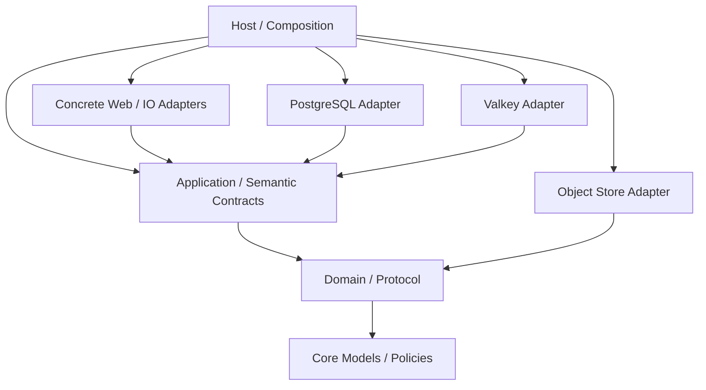

# 00 — 目标与完成定义

## 1. 最终产品定义

本任务把 NazoAuth 从“以当前 Web Framework / Async Runtime / Native Host 为实现前提的 OAuth Server”重构为：

> **与 Web Framework、Async Runtime、Host 和具体运行环境无关的 OAuth/OIDC/FAPI/OpenID4VC Application；当前 Actix + Tokio 只是 Native Host 的一种外部实现。**

最终必须成立：

```text
Application → 不知道 Actix
Application → 不知道 Tokio
Application → 不知道当前 Native Host
Application → 不根据具体实现写业务分支

Actix Adapter → Application
未来 Adapter → 同一个 Application

Native Host → Application
未来 Host → 同一个 Application
```

如果未来替换当前 Web Framework、Async Runtime 或 Host，Core / Domain / Application 的业务与协议实现仍需要修改，则本任务判定失败。

## 2. 目标依赖方向



箭头表示编译期“依赖于”。核心只看到能力和语义事实，不看到具体实现。

## 3. Application 的最终形态

Application 描述一次业务行为，例如：

```text
authorize(command/facts) -> typed outcome
userinfo(prepared, security facts) -> typed outcome
execute_token(prepared, request facts) -> typed outcome
process_due_ciba_ping_batch() -> batch result
process_due_backchannel_logout_batch() -> batch result
refresh() / rotate_if_due() -> semantic result
```

Host / Adapter 描述外部执行条件：

```text
HTTP Request extraction
HTTP Response presentation
listener / TLS
schedule / interval / sleep
spawn / cancellation / shutdown
process / filesystem / environment
concrete network execution
composition
```

Application 中“搜不到 tokio/actix”只是必要条件，不是完成条件。还必须证明 Application 能在不知道当前 Host / Framework / Runtime 的情况下独立构造、测试和调用。

## 4. Host Replacement Gate

最终必须通过以下硬门槛：

1. `nazo-oauth-server` 作为 library 可独立 `cargo check` / `cargo test`。
2. 其 normal/build 本地依赖图不存在 Adapter / Host 反向依赖。
3. `crates/authorization-server/tests/host_replacement_contract.rs` 作为独立 integration-test consumer：
   - 只使用 `nazo_oauth_server` public API 和必要的内层 semantic/domain crates；
   - 不 import `nazoauth`、`nazo_http_actix`、`nazo_openid4vc_http_actix`、`actix_*`、`tokio` 或 Native bootstrap/settings/adapters；
   - 用 fake semantic ports 覆盖至少一条 HTTP 型 Application 调用边界、一条 security-facts 边界和一条 one-shot/background-batch 边界；
   - 无 Web server / Runtime scheduler 也能构造、调用、终止。
4. 如果 public surface 不足，只能修正真实 Application public API；不得增加 test-only backdoor、Host callback、兼容导出或万能 runtime/request abstraction。
5. 不要求实现第二套生产 Web Server；要求证明第二套 Host 可以只在外层接入。

## 5. 不可妥协的工程原则

1. 第一性原则；始终寻找最短正确路径。
2. 严禁冗余、过度设计、过度防御、过度抽象。
3. 严禁 compatibility layer、旧路径转发、双定义。
4. 优先删除错误依赖，不在错误依赖外再包一层。
5. 不因“未来可能替换”抽象普通跨平台库。
6. 能使用标准 Rust / `http` 中立类型时不重新发明类型。
7. 抽象必须对应真实业务能力或真实架构边界。
8. OAuth/OIDC/FAPI/OpenID4VC、安全语义和性能语义必须保持。
9. PostgreSQL / Valkey / Object Store 已有正确边界不重新设计。
10. Moka 不在本任务范围。

## 6. 明确禁止

不得创建或等价实现：

```rust
trait Runtime
trait Executor
trait AsyncRuntime
trait WebFramework
trait GenericServer
trait Platform
trait Environment
trait GenericHttpClient
trait GenericRequest
trait GenericResponse
```

不得把具体 Request/Runtime 藏在 wrapper 中。

不得把：

```rust
tokio::spawn
tokio::time::sleep
```

简单包装成 runtime port。

正确规则只有一句：

> **Application 描述“做什么”；Host 决定“什么时候运行、如何调度、用什么具体技术执行”。**

## 7. 研究基线

代码研究与任务设计基线：

```text
commit: ff344fc37d36231ac7e648fd24d0bc657643327f
```

实施起点如已前进，执行者必须先做关键文件差异映射；不得把路径变化当成重新设计架构的理由。
