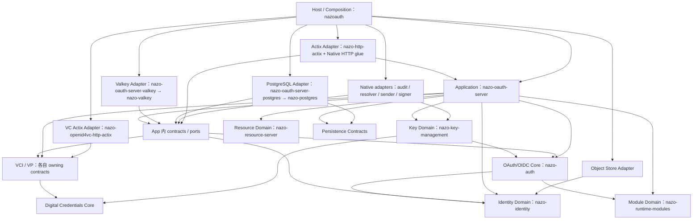

# 01 — 架构事实与固定边界

# A. 当前架构诊断

## A1. 已正确的部分

Core、identity、resource-server、persistence、runtime-capabilities、VCI / VP、digital-credentials、scim-events 中已有协议模型及语义 Ports。PG / Valkey 的事务、版本、CAS、原子消费、TTL、重放预留、命名空间保留；不重做数据库、状态存储或对象存储设计。

`authorization-server/src/bootstrap/persistence.rs` 与 `bootstrap/transient_state.rs` 已返回窄语义能力，不是向内传 pool/connection。问题是这些定义被混在 Native 所有者中；本次只移动 canonical 定义。`AvatarDirectUploadPort` 已有正确对象存储边界。

`http-actix/src/fapi_resource.rs::FapiResourceAuthorizer` 已接收 `ProtectedResourceAuthorizationRequest` / `ProtectedResourceAuthorizationContext`，**并不直接接收 HttpRequest**。不要因任务标题创建第二套 FAPI Request。`ModuleLifecycle` 是模块初始化/排空/停用的真实语义契约；SnapshotStore、generation lease、revision 和 admission 保持。

## A2. 合理的具体实现依赖

路由、extractor、web::Data、cookie / CSRF、CORS、multipart、HTTP body/status/header 构造、Rustls 连接提取、CLI 选服务器、静态 UI 均属于外层。`bootstrap/routes.rs`、`bootstrap/transport.rs` 以及 `http/mtls.rs` 中连接提取部分应移至或留在 Native/Adapter，而非一概删除 Actix。

`http-actix/src/scim.rs` 的单请求 long-poll 使用 30 秒窗口、250ms 轮询，是 transport 生命周期；Tokio 可留在那里。`persistence-postgres/src/pool.rs` 的异步 IO 位于具体 Adapter，保持不动。

## A3. 实际错误依赖与定位

| 基线位置 | 实际问题 | 固定处理 |
|---|---|---|
| `http-actix/src/userinfo.rs`；`authorization-server/src/domain/userinfo.rs` | UserinfoOperations 接收 HttpRequest；实现读取 DPoP、mTLS | T06 两阶段操作，保留按需证书提取时机 |
| `http-actix/src/scim.rs`；`domain/scim.rs` | ScimRequestAuthorizer 读 Authorization / IP / User-Agent | T06 三项专用事实 |
| `domain/resource_server.rs` | FAPI 契约、重放 Port、具体证书提取混在一起 | 重放 Port/实现归 App，提取器归 Native |
| `domain/dynamic_registration.rs` | Domain 工厂反向构造 DynamicRegistrationEndpoint | T05 编排移 App，Endpoint 工厂留 Host |
| `domain/local_registration.rs` 等 | 业务 Operations / Commands / Results 的 owner 是 http-actix | T02 契约先向内迁，T05 实现随后迁 |
| `http/token/dispatch/mod.rs` | Data、具体 registry、resolver、VC Endpoint 进入业务 handles | Arc + 已有 Ports + SnapshotStore + VCI Operations |
| `http/token/ciba/poll.rs` | SendCibaResponse 为 non-Send HTTP response 建补救包装 | T07 用业务 outcome，删除 wrapper |
| `http/authorization/request/flow.rs`；`http-actix/src/presenter.rs` | 先构造 HTTP error，再读 OAuthJsonErrorFields extension 决定协议重定向 | T09 协议先读 typed error，呈现最后执行 |
| `http/sessions.rs` | cookie 提取、账户查询、MFA/admin policy 与 HTTP error 混居 | SessionResolver 归 App；cookie/呈现留 Native |
| `openid4vc-http-actix/src/vci.rs`、`vp.rs` | 中立 Operations/Request/Response/Error 归 Actix | 分别移现有 openid4vci/openid4vp application module |

## A4. Runtime 分类

| 基线文件/能力 | 问题或合理性 | 最终归属 |
|---|---|---|
| `domain/ciba_ping_delivery.rs` | claim/finish/retry 与永久循环、spawn、500ms sleep 混合 | App 单批；Native job + sender |
| `domain/backchannel_logout_worker.rs` | 业务重试与 5s loop、DNS/HTTP 混合 | App 单批；Native job + sender |
| `domain/remote_client_documents.rs` | 具体 DNS pinning、deadline、Semaphore、reqwest | 整体 Native adapter，复用 resolver Ports |
| `domain/openid4vc/credential_crypto/mdoc.rs` | Handle::current / spawn_blocking / 同步 CoseSigner 桥 | 只迁执行桥，VC 规则留 App |
| `key-management/src/lifecycle.rs`、`model.rs`、`external.rs` | watch、refresh loop、进程执行进入 key service | refresh 留 key；loop/process 归 Native |
| `adapters/audit.rs` | 业务调用全局队列和 task-local 租户函数 | 显式审计语义能力；队列/作用域归 Native |
| `adapters/security.rs` | 普通 crypto 与 Argon2 blocking budget 混居 | crypto 内移；已有 hash/verify Ports 实现留 Native |
| `runtime_modules.rs` | registry 业务快照与 interval/drain 混居 | App 只读同一 SnapshotStore；Host 运行生命周期 |
| `adapters/audit_anchor/worker.rs` | 已有 run_iteration，是 Native exporter | 保持 Native，不再造 Port |
| `bootstrap/startup/tenant_runtime.rs` | 图发布、cache/DB reconcile、退役 | 全部 Native |
| `operator_task/*`、`keyctl/*`、`ui_release.rs`、`cli.rs` | 文件、信号、锁、部署生命周期 | Native；不抽象 Environment/Platform |

---

# B. 根因分析与唯一方案

根因是 **业务编排 package 同时承载 transport、composition 和 process lifecycle；中立契约反由具体 transport package 拥有**。目录名称无法解决 package-level 反向依赖，request/response/runtime handle 随便利参数持续渗透，随后出现 SendCibaResponse 等补救层。

| 备选 | 判断 | 决定 |
|---|---|---|
| 所有 contracts 放 nazo-auth | 使最内层承载 VC、identity、SCIM、管理模型；key 已依赖 nazo-auth，反向加入 key 可形成环 | 拒绝 |
| 新建 application / native-host crate | 方向可成立，但已有 server 与 binary package 足以表达，不满足“非新增不可”条件 | 拒绝 |
| 原 server 仅按目录或 feature 隐藏 Native | 正常依赖仍混合，feature 组合扩大；未来消费者仍面对混合 owner | 拒绝 |
| GenericRequest / RuntimePort 包装 | 藏住错误方向，不消除它 | 拒绝 |
| **复用 server 为 App、nazoauth 为 Host** | 可从第一阶段形成 Cargo 单向边界，后续逐能力闭合迁回 | **采用** |

T01 的机械迁移是一个 package 切口：旧 server 源码先整体移至现有 Native package，只留下中立 Ports；后续从外层逐能力迁入 App。它不要求一次重写所有业务，也不采用“先让 App 临时依赖 Adapter、最后再删”的路径。

`OperatorPersistence` 包含 run_migrations 与 Native operator 工作流，跟随 operator module 留 Native；`PostgresLauncher` / `PostgresOperatorPersistence` 一起迁 Native，使现有 PG Adapter 不必反向依赖 Host。Storage Port/SQL 不改。

---

# C. 目标依赖图

箭头为编译期“依赖于”。Contracts 是 owning crate 的 module，不是新 crate。图只列本次关键依赖，不声称各 Domain 都依赖同一个 core package。

---

# D. Crate 职责表

| Package | 目录 | 当前职责 | 目标职责 | 修改 |
|---|---|---|---|---|
| nazo-oauth-server | authorization-server | 业务/HTTP/启动混合 | Application、跨协议编排、中立 contracts/ports | 重构主体 |
| nazo-auth | authorization-server-core | OAuth/OIDC/FAPI 规则 | 保持 | 不改算法 |
| nazo-oauth-server-object-store | authorization-server-object-store | S3 + native storage 选择 | 保留 S3 实现；launcher/provider 装配移出 | 不改 Port |
| nazo-oauth-server-postgres | authorization-server-postgres | provider + launcher/operator | 保留 provider；Native 装配移出 | 移 composition |
| nazo-oauth-server-valkey | authorization-server-valkey | provider/factory + launcher | 保留 provider/factory；launcher 移出 | 移 composition |
| nazo-digital-credentials | digital-credentials | 凭证模型/crypto Ports | 保持 | 不再包装 |
| nazo-http-actix | http-actix | transport + contracts + DCR 编排 | HTTP extraction/presentation/routing/request lifecycle | 迁出 contracts、DCR |
| nazo-http-signatures | http-signatures | HTTP 签名协议算法 | 保持 | 不改基串 |
| nazo-identity | identity | 身份服务/Ports | 保持；七个已有 Port 补 Arc 转发 | 四个 ports 文件 |
| nazo-key-management | key-management | key 语义 + lifecycle/process | key 状态/CAS/generation/lease/refresh/验证 | 只拆 runtime/process |
| nazoauth | nazoauth | 薄 binary | Native Host + 同 package library；config/CLI/TLS/jobs/具体能力 | 大幅机械迁移 |
| nazo-openid4vc-http-actix | openid4vc-http-actix | VC transport + contracts | 只做 VC transport | 迁出中立契约 |
| nazo-openid4vci | openid4vci | VCI 领域服务 | 领域服务 + application contracts owner | 迁入既有定义 |
| nazo-openid4vp | openid4vp | VP 领域服务 | 领域服务 + application contracts owner | 迁入既有定义 |
| nazo-operator-protocol | operator-protocol | operator 协议 | 保持 | 不承担 Host/App |
| nazo-persistence | persistence | 持久化语义契约 | 保持 | 不改 |
| nazo-postgres | persistence-postgres | PG 实现 | 保持 | 不改 SQL/migration |
| nazo-resource-server | resource-server | 资源授权验证 | 保持原 neutral request/context | 不改 |
| nazo-runtime-modules | runtime-capabilities | 模块状态与快照 | 保持；暴露同一 SnapshotStore 的只读句柄 | 新增 accessor |
| nazo-scim-events | scim-events | SCIM SET 事件语义 | 保持 | 不改 |
| nazo-valkey | state-store-valkey | Valkey 实现 | 保持 | 不改 Lua/TTL/CAS |

---

# G. 最终依赖边界与方向

| Layer | 自身职责 | 允许依赖 | 禁止向内泄漏 | 组装者 |
|---|---|---|---|---|
| Core / Domain | 协议规则、状态机、模型、语义 Port | 同级与更内层协议/领域模型、普通中立库 | App/Host/Adapter、Framework request、Runtime lifecycle、具体连接句柄 | App/Host通过构造器注入 |
| Application | 一次use-case、跨Port编排、事务顺序、安全策略、单批任务、typed outcome | Core/Domain、owning contracts、neutral facts、KeyManager等语义实现 | Adapter import、HTTP response、Native globals/task-local、FS/process/bootstrap、scheduler | Host构造依赖图 |
| Contracts | 能力需求、输入/输出/错误、语义边界 | 自己owner所需领域类型、std/http | opaque Any、request wrapper、spawn/sleep能力、实现选择分支 | owner定义，外层实现/调用 |
| Adapter | extraction/presentation、具体IO、驱动/协议转换、实现语义能力 | 向内契约及必要具体库；外层实现间的组合不能反向污染内层 | 将具体对象从公开业务接口传入内层 | Host |
| Host / Composition | 选择实现、配置、CLI、启动/停止、调度、租户图生命周期 | Application、Domain、Adapters | 用Host回调把业务决定重新夺回、业务层反向依赖Host | binary入口 |

这些规则不以 Actix/Tokio 名称为中心；换成其他技术仍成立。std::Future/Pin/Arc/Duration/IpAddr、chrono、http标准类型、futures stream、普通crypto可以直接用。std锁不得持有跨await；不能把Tokio mutex机械换成阻塞锁来“通过检查”。

本任务包不要求全部Web代码集中到http-actix：Native http目录可以承载composition专用的HTTP adapter，但业务只能通过已有中立服务/Port被调用，App不能回引Native。Controller/recovery/tenant deployment等Native控制工作流不强行归OAuth Domain。

reqwest不因名字被禁止；本次移动resolver是因为真实DNS/timeout/pinning/并发/网络环境边界。纯X.509/JOSE/CBOR库继续直接使用。Moka不在范围内，现有缓存算法不更换。